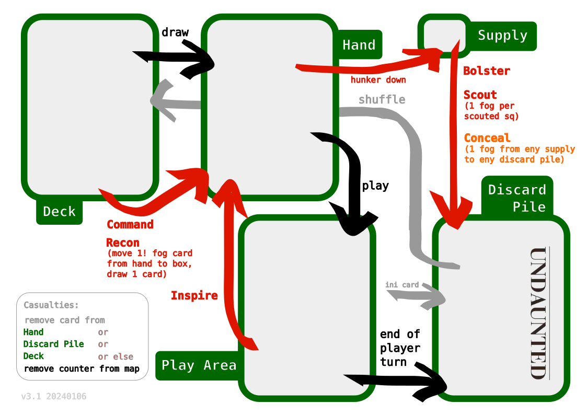
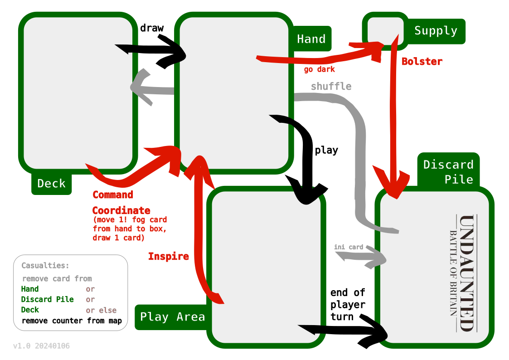

# Undaunted

Tools to play Undaunted Normandy and Battle of Britain.

## track

An A4 landscape track `Deck | Hand | Play Area | Discard Pile | Supply`.

The track as first used:

The current version of the Normandy track (click to get to the SVG):

The current version of the Britain track (click to get to the SVG):

## brother printer minimal margins

As a note to myself, 0.16" on all sides.

## license

CC BY-SA 4.0

See [LICENSE.txt](LICENSE.txt).

